  

# Hi, I'm Aviel

Software Developer at Van Spaendonck Development

I enjoy building maintainable software with .NET and Angular, and I am always exploring software architecture, Linux, networking, and system design.

Originally from Ukraine 🇺🇦, living in the Netherlands 🇳🇱 since 2022.

---

## About Me
- Software Developer at Van Spaendonck Development
- MBO Software Development graduate (EQF Level 4)
- Currently studying HBO-ICT (part-time) and expanding my engineering fundamentals

### Experience With
- C#, ASP.NET Core, .NET
- SQL and Database Design
- Angular, Blazor
- Git and CI/CD
- Linux and CLI workflows

### Interests
- Backend development
- System configuration and optimization
- Home servers and networking
- Clean code and maintainable systems
- Software architecture

---

## Environment & Workflow
- Windows (primary at work), macOS (school and personal use)
- Linux (home servers and personal projects), Asahi Linux (Apple Silicon)
- Hyprland (Wayland), setup based on JaKooLit Hyprland-Dots (now maintained by [LinuxBeginnings](https://github.com/LinuxBeginnings))
- CLI-first workflow, Git, terminal tooling
- Catppuccin (Latte and Macchiato) with Peach accent (`#f5a97f`)

---

## Activity & Stats

  
  

  

  

---

## Personal
Anime • coffee • matcha • tea

---

## Philosophy
Freedom in technology, deep understanding, and clean design.
